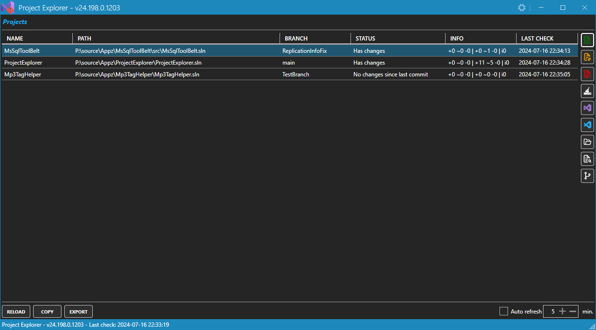
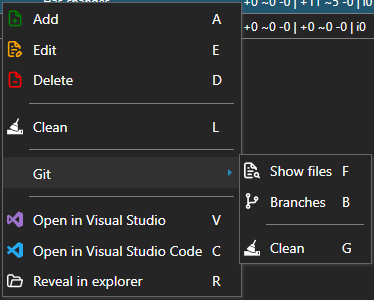
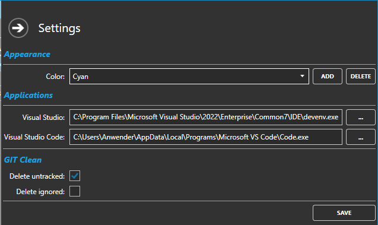

# ProjectExplorer

**Content**

<!-- TOC -->

- [General](#general)
    - [Important note](#important-note)
- [The UI](#the-ui)
    - [Main](#main)
    - [Context menu](#context-menu)
    - [Settings](#settings)

<!-- /TOC -->

---

## General

The "ProjectExplorer" is a C# help tool with which various "projects" (or solutions) can be viewed in one place.

In addition, information from GIT is displayed if the project is managed with the help of GIT.

### Important note

The program is currently still at a very early stage. It is therefore possible that some functions are not yet working 100% correctly. Particular care should therefore be taken with the delete functions (*Clean*, *GIT Clean*)!

## The UI

### Main

All added projects are displayed in the main view. The GIT information is also displayed here.

The available options can be accessed on the right using the buttons on the side or via the context menu.

### Context menu

> **Note**: The context menu options are also located on the right-hand side.

The context menu offers the following options:

| Option | Key | Description |
|---|---|---|
| Add | A |Adds a new project. |
| Edit | E | Edits the selected project (you can change the path or change the name of the project). |
| Delete | D | Removes the selected project from the list. |
| Clean | L |Deletes the `bin` and `obj` folder of the project. **NOTE**: This action **cannot be undone**! |
| Git > Show files | F | Shows a list of all *changed* / *added* files. |
| Git > Branches | B | Shows a list of all detected branches. |
| Git > Clean | G | Depending on the settings, the untracked and ignored files are deleted. **NOTE**: This action **cannot be undone**! |
| Open in Visual Studio | V | Opens the project in Visual Studio. |
| Open in Visual Studio Code | C | Opens the project folder in Visual Studio Code. |
| Revel in explorer | R | Opens the project folder in the Windows Explorer. |

> **Note**: The application path must be stored in the [settings](#settings) for the *Open in Visual Studio* and *Open in Visual Studio Code* options.

> **Note 2**: Instead of the buttons on the right-hand side or the context menu, you can also press the corresponding letter.

### Settings

The following settings can be made:

- Appearance
    - *Color*: The color schema (custom color or default colors are available).
- Applications
    - *Visual Studio*: The path of Visual Studio
    - *Visual Studio Code*: The path of Visual Studio Code
- GIT Clean
    - *Delete untracked*: If checked, all *untracked* files will be deleted during the *GIT Clean*
    - *Delete ignored*: If checked, all *ignored* files will be deleted during the *GIT Clean*